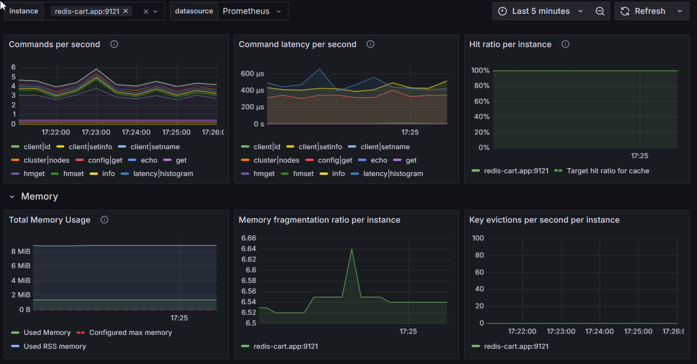

<div align="center">
  <br>
  <p align="center">
      <a href="https://ensimag.grenoble-inp.fr/">
          
      </a>
  </p>
  
  <p align="center">
      <h2 align="center">Lab Assignment (Fall 2024) - Report</h2>
  </p>

  <p align="center">
      <strong>Authors</strong>
      <br>
      FIALI Mouad
      <br>
      HAMDANE Yassine
  </p>

  <p align="center">
      <strong>Supervised by</strong>
      <br>
      Prof. Thomas ROPARS
  </p>
</div>

# Table of Contents

# Base steps

## Deploying the original application in GKE

As a first step in our implementation, we focused on deploying the Online Boutique application in its basic configuration to establish a functional baseline. We used Terraform to provision and configure the Google Kubernetes Engine (GKE) cluster, ensuring an infrastructure-as-code approach from the start. 

We relied on the terraform configuration provided by the [GCP microservices-demo repository](https://github.com/GoogleCloudPlatform/microservices-demo/tree/main/terraform) with several modifications to adapt it to our needs. The main components of the configuration are as follows:

1. ### GKE Cluster Configuration:

    - We configured two possible cluster types through Terraform: Standard and Autopilot

    - The Standard cluster was configured with:
        - Machine type: e2-standard-2
        - Initial node count: 4 nodes
        - Region-specific deployment

    - Autopilot mode was also kept as an alternative, offering managed node provisioning

    Note that all these configurations were made dynamic through the use of variables in the Terraform configuration.

2. ### Application Deployment:

    - At first, we deployed the application using the Kustomize tool and we used the provided kustomization files to deploy the application in the cluster.

    ```shell
    resource "null_resource" "apply_deployment" {
        provisioner "local-exec" {
            command = <<EOT
            kubectl create namespace ${var.namespace}
            kubectl apply -k ${var.filepath_manifest} -n ${var.namespace}
            EOT
        }
    }
    ```
3. ### Load generator Deployment:

    A key part of this initial deployment was also setting up the load generator. For this initial phase, we deployed a VM outside the GKE cluster and used a simple Docker Compose file to run Google's `loadgenerator` image without modifications. This setup provided a basic testing capability, though we would later enhance various parameters and configurations which we will discuss in the [Deploying the load generator](#deploying-the-load-generator) section.

    

## Analyzing the provided configuration

In this part, we will analyze one of the services of the application and its configuration. We chose to analyze the `frontend` service which is the entry point of the application. Let's break down its key components:

1. ### Deployment:

- `apiVersion: apps/v1` - Specifies the Kubernetes API version
- `kind: Deployment` - Defines this as a Kubernetes Deployment resource
- `metadata`: Contains basic information about the Deployment (name, labels)
- `spec`: Defines the desired state, including:
    - `selector`: A label selector that determines which Pods are controlled by this Deployment (in this case, Pods with the label `app: frontend`)
    - `template`: Pod configuration template:
        - `securityContext`: Specifies security settings for the Pod (in this case, run as non-root user with the UID 1000)
        - `containers`: Container specifications:
            - `securityContext`: Specifies security settings for the container (in this case, enforces no privilege escalation and read-only filesystem)
            - `image`: Uses the official frontend microservice image
            - `readinessProbe`: Checks if the service is ready to accept traffic (Without this component, the service would be considered ready as soon as the container starts, which may not be accurate, as the application may still be initializing)
            - `livenessProbe`: Checks if the service is still running (If the liveness probe fails, the container is restarted)
            - `resources`: Defines CPU and memory limits/requests
            - `env`: Sets service discovery environment variables

2. ### Service:

    A Kubernetes Service is an abstraction that defines a logical set of Pods and a policy by which to access them. Two services expose the frontend:

    - *Internal Service (ClusterIP):*
        - Enables cluster-internal communication
        - Maps port 80 → 8080

    - *External Service (LoadBalancer):*
        - Exposes the application externally (to the internet)
        - Creates cloud load balancer for public access on port 80

3. ### Service account:

    This service account is used to authenticate the frontend service to other services in the cluster and authorize it to access resources.

4. ### Customization with Kustomize:

    The base configuration can be enhanced using Kustomize patches to enable or disable specific features. For example, observability features can be enabled through patches:

    ```yaml
    # Example patch for enabling tracing and profiling
    - patch: |-
        apiVersion: apps/v1
        kind: Deployment
        metadata:
        name: frontend
        spec:
        template:
            spec:
            containers:
                - name: server
                env:
                - name: ENABLE_TRACING
                    value: "1"
                - name: ENABLE_PROFILER
                    value: "1"
    ```
    This patch mechanism allows for flexible configuration management without modifying the base YAML files, enabling features like tracing, profiling, and other components based on deployment requirements.

5. ### Customization with Helm:

    The frontend service can also be customized using Helm. Helm is another tool that can be used to manage Kubernetes applications. It provides a templating engine to generate Kubernetes YAML files and a package manager to manage application dependencies. We will discuss this method in more details in the [Helm chart section](#helm-chart) as it's the one we chose to use in our implementation.

## Deploying the load generator

For load testing our application, we implemented a sophisticated deployment of the load generator (that was provided by the [GCP microservices-demo repository](https://github.com/GoogleCloudPlatform/microservices-demo/tree/main/src/loadgenerator)) with several enhancements for automation, observability and security. Here's our approach:

1. ### Deployment Architecture

    In order to facilitate the task, we used Ansible and Docker Compose to create a robust and secure load testing environment. The [docker-compose.yml](./scripts/docker-compose.yml) file defines the services and their configurations. The main components are:

    - *Load Generator Service:*

        ```yaml
        loadgenerator:
            image: us-central1-docker.pkg.dev/google-samples/microservices-demo/loadgenerator:v0.10.2
            entrypoint: locust --host="http://${FRONTEND_ADDR}" 2>&1
        ```
        Note that we modified the default headless configuration to expose Locust's web interface locally, enabling access to detailed metrics and controls. Note that locust's web interface is only accessible locally (which is done by not exposing the port 8089 to the outside world). This is a security measure to prevent unauthorized access to the load generator.

    - *Locust Exporter:*

        ```yaml
        locust-metrics-exporter:
            image: containersol/locust_exporter
            ports:
                - "9646:9646"
        ```
        This service exports Locust metrics in Prometheus format, allowing for easy integration with monitoring our monitoring stack.

    - *Frontend Health Check:*

        A preliminary check that ensures the frontend service is available before starting the load generator.

2. ### Automation with Terraform & Ansible

    We used Ansible to automate the deployment of the load generator. The [`load-generator.tf`](./terraform/load-generator.tf) Terraform file provisions a VM instance in the same VPC (Virtual Private Cloud) as the GKE cluster, then it creates a dynamic inventory file for Ansible to use.

    ```shell
    resource "local_file" "ansible_inventory" {
        count    = local.create_load_generator ? 1 : 0
        filename = "../ansible/inventory.yml"
        content  = <<-EOT
        // ...
            hosts:
                load_generator:
                ansible_host: ${google_compute_instance.load_generator[count.index].network_interface[0].access_config[0].nat_ip}
        // ...
    }
    ```
    The Ansible playbook [`deploy-load-generator.yml`](./ansible/deploy-load-generator.yml) then installs Docker and Docker Compose on the VM, and determines the correct service IP (frontend or ingress gateway) in order to pass it to the load generator container. Finally, it starts the load generator and swarms the target service (frontend) with requests (Users count: 10, spaw rate: 1).

    Another important ansible playbook is the [`swarm-load-generator.yml`](./ansible/swarm-load-generator.yml) which is used to automate load test parameter changes. This is done by curling the `/swarm` endpoint of the load generator service, with the desired parameters (users count, spawn rate, target host). This playbook is used to dynamically adjust the load testing parameters during the test execution.

    ```yaml
      uri:
        url: "http://localhost:8089/swarm"
        ...
        body: "user_count={{ users }}&spawn_rate={{ spawn_rate }}&host=http://{{ ingress_ip.stdout }}:80"
        status_code: 200
    ```
3. ### Monitoring Integration:

    The metrics exporter container publishes Locust metrics which are then:

    - Scraped by Prometheus (configured separately)
    - Visualized in custom Grafana dashboards

    This setup will be further detailed in the [monitoring section](#monitoring-the-application-and-the-infrastructure), where we discuss our monitoring solution including dashboards, alerts, etc.

The entire architecture provides a secure, automated, and observable load testing environment that can be easily controlled and monitored while maintaining security best practices.

# Intermediate steps

## Helm chart 
The Google microservices-demo repository includes a Helm chart for deploying the application, which simplifies the deployment process. However, the provided Helm chart did not fully meet our requirements. For instance, modifying the application’s source code requires building a new image, pushing it to a container registry, and updating the Helm chart to reference the new image. Unfortunately, the container registry and image tags are hardcoded in the default Helm chart, limiting deployment flexibility. This is just one example of its limitations.

To address these limitations, we decided to create our own Helm chart for the Online Boutique application. Our custom chart is heavily inspired by the one provided by Google but includes several modifications to make it more flexible and better suited to our specific requirements.

1. ### Overview of Helm implementation

    The Helm chart is structured as follows:

    - [`Chart.yaml`](./helm-chart/Chart.yaml): Contains metadata about the chart
    - [`values.yaml`](./helm-chart/values.yaml): Contains default values for the chart
    - [`templates/`](./helm-chart/templates/): Contains the Kubernetes manifests for each service
    - [`templates/common.yaml`:](./helm-chart/templates/common.yaml) Contains common configurations shared by multiple services

    This structure offers several advantages such as centralized configuration management and easy enabling/disabling of features.

2. ### Key changes & customizations

    #### Custom Image Repository: 

    ```yaml
    images:
        repository: registry.gitlab.com/hamdane10/gke-cloud-project 
    ```
    We moved from Google's public repository to our private GitLab registry, enabling us to:

    - Modify service implementations when needed
    - Maintain control over image versions
    - Add custom features to specific services

    This required adding image pull secrets to all manifests:
    ```yaml
    imagePullSecrets:
        - name: gitlab-registry-secret
    ```
    #### Independent Service Versioning:
    
    Instead of using a single version for all services (which is the case of Google's helm chart), we implemented independent versioning in order to:

    - Allow service-specific updates
    - Enable gradual rollouts
    - Facilitate testing for canary releases by updating specific services
    - Maintain better version control per service

    #### Horizontal Pod Autoscaling Configuration:

    ```yaml
    hpa:
        enabled: false
        minReplicas: 2
        maxReplicas: 50
        targetCPUUtilizationPercentage: 70
    ```
    Each service includes configurable HPA settings, allowing:

    - Service-specific scaling policies
    - Fine-tuned resource utilization
    - Flexible scaling boundaries

    The Horizontal Pod Autoscaling will be further discussed in the [Autoscaling section](#autoscaling-technical).

    #### Canary Release Configuration:

    ```yaml
    frontend:
        canary:
            create: false
            progressDeadlineSeconds: 60
            analysis:
            interval: 30s
            threshold: 10
            maxWeight: 25
            stepWeight: 2
            successRate: 99
            metricInterval: 30s
            duration: 500
    ```
    We added canary release configurations to the frontend service. The canary release is disabled by default but can be enabled with a simple flag. 

The templates intelligently combine global configurations with service-specific settings, creating a flexible yet consistent deployment structure. Additional features like NetworkPolicies, Sidecars, and AuthorizationPolicies can be enabled through simple flags in the values file.

This Helm-based approach provides the foundation for more advanced features we'll discuss in later sections, such as autoscaling, canary deployments, tracing etc.


## Continuous Integration & Continuous Deployment

We implemented a robust CI/CD pipeline using *GitLab CI* for building and deploying our application, coupled with *ArgoCD* for GitOps-based deployment management.

1. ### CI Pipeline

    Our CI implementation consists of two main pipelines:

    #### Service Build Pipeline ([`.gitlab-ci-deploy.yml`](./.gitlab-ci-deploy.yml)):

    - Parse Version: Automatically increments service version based on commit message tags (#major, #minor, #patch)
    - Build: Builds Docker images and pushes them to our private [container registry](https://gitlab.com/Hamdane10/gke-cloud-project/container_registry)
    - Deploy: Updates the Helm chart's values.yaml with new image versions (triggering the Helm chart pipeline)

        This pipeline is triggered when code changes are detected in a service's directory:
        
        ```yaml
        rules:
            - if: '$CI_COMMIT_BRANCH == "master"'
                changes:
                - src/$COMPONENT_PATH/**/*
        ```

    #### Helm Chart Pipeline ([`.gitlab-ci-helm.yml`](./.gitlab-ci-helm.yml)):

    - Validate: Verifies versioning and updates chart version based on commit message tags (#major, #minor, #patch). In the case where it's triggered by the service build pipeline, the tag used is (#patch)
    - Package Release: Packages and publishes the Helm chart to our private [package registry](https://gitlab.com/Hamdane10/gke-cloud-project/-/packages)

        This pipeline can be either triggered by the service build pipeline or by a direct commit to the Helm chart directory:
        
        ```yaml
        rules: 
            - if: '$CI_COMMIT_MESSAGE =~ /#(major|minor|patch)/'
                changes:  
                - helm-chart/**/*
        ```

        Generally speaking, it is triggered by a commit to the Helm chart directory containing the (major|minor|patch) tag in the commit message. This allows for other changes to the Helm chart to be deployed without incrementing the chart version.

    In both pipelines, the versioning logic is implemented using a custom script that parses commit messages and increments the version accordingly depending on the tag found:
    
    - #major: 1.0.0 → 2.0.0
    - #minor: 1.0.0 → 1.1.0
    - #patch: 1.0.0 → 1.0.1
    

2. ### ArgoCD Integration

    ArgoCD is a declarative continuous delivery tool for Kubernetes that follows the GitOps pattern. We use it to:

    - Monitor our Helm chart repository (GitLab package registry)
    - Automatically detect configuration changes
    - Sync the cluster state with the desired state
    - Provide visualization of deployment status

    The ArgoCD application is deployed in the GKE cluster and is configured to monitor the Helm chart repository. When a new version of the Helm chart is published, ArgoCD automatically detects the change and updates the cluster state accordingly.

This CI/CD pipeline provides a robust and automated deployment process that ensures consistency and reliability across all services. Here's a high-level overview of the pipeline:

<p align="center">
    
</p>

# Advanced & Bonus steps

We decided to merge the advanced and bonus steps as they are very related (or at least most of them). Note that we implemented other bonus steps other than the ones mentioned here (and in the lab instructions), but we chose to talk about them in other parts of the report, to maintain a logical order.

## Monitoring the application and the infrastructure

1. ### Base Monitoring Stack Implementation:

    We implemented our monitoring stack using the Prometheus Community Kubernetes Stack ([kube-prometheus-stack](https://github.com/prometheus-community/helm-charts/tree/main/charts/kube-prometheus-stack)), deployed via Helm. This choice offered several advantages:

    - Pre-configured node-exporter for hardware and OS metrics
    - Built-in cAdvisor for container metrics
    - Default Grafana dashboards for Kubernetes monitoring
    - Integrated AlertManager for alert management (The configured alerts are mainly related to the nodes and the pods health and performance and the cluster state)
    - ServiceMonitor CRD for automatic service discovery

2. ### Automated Deployment Process:

    We automated the entire monitoring setup using Ansible:

    ```yaml
    - name: Install Prometheus stack using Helm
      shell: >
        helm upgrade --install kube-prometheus-stack prometheus-community/kube-prometheus-stack 
        --namespace monitoring
        --values /tmp/prom-grafana-values-temp.yaml
    ```
    The automation includes:

    - Namespace creation
    - Helm repository management
    - Dashboard ConfigMap creation based on the provided dashboards in the [dashboards](./ansible/dashboards) directory
    - SMTP configuration for alerts

3. ### Enhanced Observability Stack:

    In order to help us monitor the application and the infrastructure more effectively, we integrated several additional components to enhance our observability stack:

    - #### Component-Specific Monitoring
        We added a custom redis exporter to monitor the Redis service. This exporter collects metrics from the Redis database and exposes them in Prometheus format. The exporter is deployed as a sidecar container in the Redis pod, and its metrics are scraped by Prometheus.

        ```yaml
        additionalScrapeConfigs:
            - job_name: redis-exporter
                static_configs:
                - targets:
                - redis-cart.app:9121
        ```
        This configuration allows us to gather Redis-specific metrics, such as memory usage, connection statistics, command execution metrics, and visualize them in a dedicated Grafana dashboard.

        [](./assets/redis-sidecar.png)

    - #### Distributed Tracing:
        The original Online Boutique application came with OpenTelemetry configuration available through feature flags in the Helm values:

        ```yaml
        opentelemetryCollector:
            create: false
            tracing:
                enabled: false
        ```
        However, the provided configuration was tightly coupled with Google Cloud's infrastructure, sending traces to Google Cloud Trace service. This platform dependency would limit the application's portability and increase vendor lock-in.

        To address this, we modified the OpenTelemetry collector configuration to use [Grafana Tempo](https://grafana.com/oss/tempo/) instead. Tempo is an open-source, highly scalable distributed tracing backend that:

        - Supports multiple tracing protocols (Jaeger, Zipkin, OpenTelemetry)
        - Provides cost-efficient trace storage using object storage
        - Integrates seamlessly with Grafana for visualization

        The integration required two main components:

        - Tempo Configuration ([tempo-values.yaml](./ansible/custom-values/tempo-values.yaml)):
            ```yaml
            tempo:
                receivers:
                    otlp:
                    protocols:
                        grpc:
                        endpoint: "0.0.0.0:4317"
                        http:
                        endpoint: "0.0.0.0:4318"
            ```
        - OpenTelemetry Collector Configuration ([opentelemetry-collector.yaml](./helm-chart/templates/opentelemetry-collector.yaml)):
            ```yaml
            exporters:
                otlp:
                    endpoint: tempo.monitoring.svc.cluster.local:4317
                    tls:
                    insecure: true

            service:
                pipelines:
                    traces:
                    receivers: [otlp]
                    exporters: [otlp]
            ```

       Since the microservices were already instrumented to send traces to the OpenTelemetry collector, our modification of the collector's configuration was sufficient to redirect traces to Tempo. This approach allowed us to:

        - Maintain the existing instrumentation in the applications
        - Switch tracing backends without code changes
        - Keep the tracing solution platform-independent

        We then integrated Tempo with Grafana as a data source and created a dedicated tracing dashboard to visualize:

        - End-to-end request flows
        - Service dependencies
        - Performance bottlenecks
        - Error propagation

        This implementation demonstrates how we leveraged the existing tracing infrastructure while making it more portable and platform-independent, all while maintaining the ability to visualize and analyze distributed traces effectively which will help us in debugging the application and identifying performance bottlenecks and their root causes.


    - #### Logging Infrastructure

        Similar to tracing, we extended the OpenTelemetry collector's capabilities to handle logging. Then we integrated it with [Grafana Loki](https://grafana.com/oss/loki/), a horizontally-scalable, highly-available log aggregation system designed to be cost-effective and easy to operate.
        The collector configuration was enhanced to capture container logs:
        
        ```yaml
        receivers:
            filelog:
                include:
                - /var/log/pods/*/*/*.log
                start_at: beginning
                include_file_path: true
        ```
        And forward them to Loki:
        
        ```yaml
        exporters:
            loki:
                endpoint: http://loki-write.monitoring.svc.cluster.local:3100/loki/api/v1/push
        ```
        More details about the logging infrastructure will be discussed in the [Implementing a Logging Solution for the Online Boutique Application](#implementing-a-logging-solution-for-the-online-boutique-application) section.

    - #### Flexible Component Enablement

        We implemented a flexible deployment model where observability components can be selectively enabled or disabled through feature flags:

        ```yaml
        opentelemetryCollector:
            create: false  # Controls the entire collector deployment
            tracing:
                enabled: false  # Controls tracing pipeline
            logging:
                enabled: false  # Controls logging pipeline
        ```
        This configuration demonstrates our helm chart's adaptability to different observability requirements, and explains once again why we chose to build our own Helm chart.

        Here is a high-level overview of the open-telemetry collector architecture:

        <p align="center">
            <a href="assets/opentelemetry.png">
                
            </a>
        </p>

    - #### Custom Dashboards:

        Our monitoring solution leverages a mix of pre-configured and custom Grafana dashboards organized into three main categories:

        - **Custom Dashboards:**

            - Locust Test: Custom dashboard for load testing metrics modified from public template
            - Redis Dashboard: Modified from public template for Redis metrics
            - Tracing: Custom-built dashboard for distributed tracing visualization

            <p>
                <a href="assets/redis-dashboard.png">
                    
                </a>
                <a href="assets/locust-dashboard.png">
                    
                </a>
            </p>

            <br>

            <a href="assets/tracing-dashboard.png"></a>

        - **Istio Dashboards**:

            - Standard suite of Istio dashboards imported from [Grafana Labs](https://grafana.com/grafana/dashboards/)
            - Includes specialized views for mesh, performance, canary deployments, and service monitoring

        - **Loki Dashboards**:

            - Container Log Dashboard: For centralized log visualization and analysis

        The dashboards are sourced through two methods:

        - Direct import from [Grafana Labs](https://grafana.com/grafana/dashboards/) using dashboard IDs
        - Custom JSON configurations stored in the [dashboards](./ansible/dashboards/) directory for modified or custom dashboards

        This setup provides comprehensive visibility into our application's performance, behavior, and health while leveraging established community dashboards where appropriate.

3. ### Alerting & Notifications:

    Our monitoring stack includes an integrated AlertManager for managing alerts. Many alerts are imported by default with the helm chart of the monitoring stack, such as:

    - **Node Health Alerts:**
        - High CPU/Memory Usage
        - Disk Space Exhaustion
        - Network Issues

    - **Pod Health Alerts:**
        - CrashLoopBackOff
        - High Restart Count
        - Resource Limit Exceeded

    In addition to these default alerts (these are just examples), we added custom alerts to suit our specific requirements. Here are the alerts rules that we added:

    ```yaml
    additionalPrometheusRulesMap:
        canary-alerts:
            [ ... ]
        locust-alerts:
            [ ... ]
    ```
    The canary alert rules are designed to trigger notifications when canary deployments fail to meet success criteria (More details will be included in the [Canary releases](#canary-releases)). While the locust alert rules are designed to trigger notifications when the failure rate of requests exceeds a certain threshold (e.g., 1%). This last alert does not make much sense in a production environment, instead we should have an alert that triggers when the failure rate of real requests exceeds a certain threshold. So in our case, it only simulates a real-world scenario where the application is under heavy load and some requests are failing.

    These alerts are configured to trigger notifications via email. And in order to do this, an SMTP configuration is required in the alert manager configuration ([prom-grafana-values.yaml](./ansible/custom-values/prom-grafana-values.yaml)):

    ```yaml
    alertmanager:
        config:
            global:
                resolve_timeout: 5m
                smtp_from: 'alerting@grafana.com'
                smtp_smarthost: host-value
                [ ... ]
            [ ... ]
    ```
    The SMTP configuration is used to send alerts to a specific email address when a rule is triggered. For testing purposes, we used an SMTP server provided by [Mailtrap](https://mailtrap.io/). Mailtrap is a fake SMTP server for development teams to test, view, and share emails.

    

### Performance evaluation
#### Methodology
- Service Level Objective
- Scenarios
#### Before autoscaling
- Configuration
- Tests
- Results
#### After HPA
#### After Cluster autoscaling

## Deploying Online Boutique with Service Mesh

Inspired by the article ["Use Helm to simplify and secure the deployment of Online Boutique, with Service Mesh, GitOps, and more"](https://medium.com/google-cloud/online-boutiques-helm-chart-to-simplify-the-setup-of-advanced-scenarios-with-service-mesh-and-246119e46d53), we enhanced the deployment of the Online Boutique application by integrating a service mesh using Istio. 

### What is Istio and Service Mesh?
Istio is an open-source service mesh that simplifies managing communication between microservices in a distributed application. It provides features like traffic management, security, and observability by deploying sidecar proxies alongside application containers. These proxies handle communication between services, enabling consistent policies and monitoring without modifying the application code.

### Automation and Platform Independence
To ensure platform independence, we automated the deployment of Istio and Kiali using Ansible in the playbook [install-istio-flagger.yml](ansible/install-istio-flagger.yml). This approach allows us to deploy the application on any Kubernetes cluster without relying on platform-specific tools like Google Cloud’s Istio add-ons. 

### What is Kiali?
Kiali is a visualization tool for Istio that provides insights into the service mesh topology, traffic distribution, and application performance. It integrates seamlessly with Istio to help monitor and troubleshoot service mesh deployments.

### Maintaining Original Helm Chart Sidecars
We retained the original Sidecar definitions from the Helm chart. Below is an example of the Sidecar configuration for the frontend microservice:

```yaml
apiVersion: networking.istio.io/v1
kind: Sidecar
metadata:
  generation: 1
  labels:
    argocd.argoproj.io/instance: online-boutique
  name: frontend
  namespace: app
spec:
  egress:
  - hosts:
    - istio-system/*
    - ./adservice.app.svc.cluster.local
    - ./cartservice.app.svc.cluster.local
    - ./checkoutservice.app.svc.cluster.local
    - ./currencyservice.app.svc.cluster.local
    - ./productcatalogservice.app.svc.cluster.local
    - ./recommendationservice.app.svc.cluster.local
    - ./shippingservice.app.svc.cluster.local
    - ./opentelemetrycollector.app.svc.cluster.local
  workloadSelector:
    labels:
      app: frontend
```

this Sidecar defines how the service interacts with the rest of the mesh. This configuration:

1. **Controls Outbound Traffic:** It specifies the egress hosts that the frontend service can communicate with, including other services in the application (e.g., `adservice`, `cartservice`) and Istio system components.
2. **Ensures Security:** By restricting communication to defined hosts, it prevents unauthorized access and enforces security policies.
3. **Supports Service Mesh Operations:** Enables advanced Istio features like traffic routing, monitoring, and fault injection by ensuring all outbound traffic is routed through the mesh.

This approach ensures the frontend service communicates securely and efficiently with other components, leveraging Istio’s features to provide observability and traffic control.

### Purpose of Service Mesh and Usage Cases
Service meshes like Istio simplify managing complex microservices architectures by handling networking concerns such as:
- **Traffic Control:** Managing how requests are routed between services.
- **Observability:** Providing insights into traffic flow and service dependencies.
- **Security:** Enabling secure communication through mutual TLS (mTLS).

In the next section, we explore how service mesh features like traffic control are utilized for progressive delivery with canary releases.

## Canary Releases

### Manual Canary Deployment in Kubernetes

Manually implementing a canary deployment in Kubernetes involves deploying a new version of an application alongside the existing one and managing traffic distribution between them. This process typically includes:

1. **Creating a Separate Deployment**: Deploy the new version as a separate Deployment resource.

2. **Service Management**: Configure Services to route traffic to both the stable and canary versions.

3. **Traffic Splitting**: Manually adjust the number of replicas in each Deployment to control the proportion of traffic each version receives.

**Some limitations of Manual Canary Deployment**:

- **Inflexible Traffic Control**: Achieving precise traffic distribution, such as directing 1% of traffic to the canary version, requires a large number of replicas (e.g., 100 replicas for 1% traffic), which is resource-intensive and impractical.

- **Coupled Scaling and Traffic Management**: In Kubernetes, traffic distribution is inherently linked to the number of pod replicas. This coupling complicates scenarios where independent scaling and traffic routing are desired.

### Automated Canary Releases with Flagger, Istio, and ArgoCD

We implemented automated canary releases using the following tools:

1. **Flagger**: An open-source progressive delivery tool that automates canary deployments by analyzing metrics and triggering traffic shifts or rollbacks.

2. **Istio**: A service mesh that manages traffic distribution between primary and canary deployments and simplifies network-level operations.

3. **Kiali**: A visualization tool that provides a UI for monitoring and verifying traffic distribution between primary and canary deployments.

We automated the deployment of Istio, Flagger, and Kiali, along with the necessary configurations and components, to implement canary releases using the ansible playbook [install-istio-flagger.yml](ansible/install-istio-flagger.yml).

### Traffic Distribution using Istio

In our setup, Istio addresses the challenges of manual deployments by:

- **Decoupling Traffic Management from Scaling**: Istio separates traffic routing from deployment scaling, which allows for precise traffic control without the need for proportional scaling of replicas.

- **Fine-Grained Traffic Control**: Istio enables routing a specific percentage of traffic to the canary version without requiring a corresponding number of replicas, facilitating more efficient resource utilization.

- **Automated Rollbacks**: When integrated with Flagger, Istio can automatically revert to the stable version if the canary deployment exhibits issues, reducing downtime and manual intervention.

### Canary Releases Process in our Setup

1. A developer makes a change to the source code of a microservice and commits the update.

2. The CI pipeline builds the new container image and Helm chart.

3. ArgoCD detects changes in the Helm chart and deploys the new version.

4. Flagger identifies the deployment change and creates a canary deployment while keeping the primary deployment (stable version) running.

5. Istio manages traffic distribution between the primary and canary deployments.

6. Prometheus collects metrics for the canary analysis, which Flagger evaluates:

   - If metrics pass the defined criteria, the canary is promoted to primary, becoming the new stable version.

   - If metrics fail, Flagger automatically rolls back traffic to the primary version.

<p align="center">
    
</p>

### Canary Release Implementation for the Frontend Microservice

To implement the Canary release for the frontend microservice, we defined a Flagger Canary object with the following default configuration:


```yaml
apiVersion: flagger.app/v1beta1
kind: Canary
metadata:
  name: frontend
  namespace: <release-namespace>
spec:
  targetRef:
    apiVersion: apps/v1
    kind: Deployment
    name: frontend
  progressDeadlineSeconds: 60
  service:
    port: 80
    targetPort: 8080
    portName: http
    gateways:
      - asm-ingress/asm-ingressgateway
    hosts:
      - "*"
  analysis:
    interval: 30s
    threshold: 10
    maxWeight: 25
    stepWeight: 2
    metrics:
    - name: request-success-rate
      threshold: 99
      interval: 30s
    - name: request-duration
      threshold: 500
      interval: 30s
```

The `analysis` section defines the Canary analysis to be performed. In this case, the analysis will:
- Evaluate **request-success-rate**, ensuring at least 99% of requests are successful during the evaluation period.
- Check **request-duration**, ensuring that the average request latency remains below 500ms.

The analysis runs at 30-second intervals and gradually increases traffic to the Canary by `stepWeight` (2%) until it reaches the `maxWeight` (25%). If any threshold is violated, the Canary will be rolled back automatically.

#### Testing Successful Canary Promotion

To verify the success of a Canary deployment with a working image change, we made a small change to the frontend source code. Flagger created the Canary deployment as explained earlier. Once the new revision was detected, we observed the Canary's events. The traffic weight increased over time until it reached the maximum weight of 25%, at which point the Canary was promoted:

<p align="center">
    
</p>

We also verified the traffic distribution between the Canary and the primary deployment using the Kiali UI:

<p align="center">
    
</p>

Additionally, we monitored both the Canary and primary deployments using one of the public Grafana dashboards we provisioned:

<p align="center">
    
</p>

#### Testing Failed Canary and Automatic Rollback

To test failure handling, we introduced an artificial delay of 3 seconds in the frontend endpoints (except the health check endpoint, so the readiness probe would not fail), the container image of this version of the frontend is `registry.gitlab.com/hamdane10/gke-cloud-project/frontend:v0.10.9`. When Flagger created the Canary deployment, the analysis started, but this time it failed because the request durations exceeded the defined threshold of 500ms. This triggered an automatic rollback:

<p align="center">
    
</p>

We also configured a Prometheus alert to trigger when Flagger initiates a rollback due to a Canary failure:

<p align="center">
    
</p>

### Key Improvements and Best Practices

The Canary analysis we defined for the frontend works well for testing and demonstration purposes, but there’s still room for improvement to make it more production-ready. Drawing from the recommendations in `The Site Reliability Workbook,` Chapter 16: [Canarying Releases](https://sre.google/workbook/canarying-releases/), we have identified areas where we can improve our canary, as well as what we are already doing well :

#### What We’re Already Doing Well
- **Automated Deployments**: We’ve automated canary releases using Flagger, Istio, and ArgoCD. This setup removes manual errors and makes the whole process more reliable.
- **Traffic Splitting**: Thanks to Istio, we can route specific percentages of traffic to the canary version without worrying about scaling the number of replicas.
- **Automatic Rollbacks**: Flagger is set to roll back automatically if the canary deployment doesn’t meet the defined thresholds, which saves time and avoids downtime.
- **Monitoring and Metrics**: We’ve already got a solid foundation with metrics like request-success-rate and request-duration to evaluate the canary’s performance.
- **Distributed Tracing**: We’re already using OpenTelemetry, Tempo, and Grafana to trace requests across services, giving us valuable insights into performance and bottlenecks.

#### Where We Can Improve
- **More Sophisticated Traffic Routing**: Instead of just splitting traffic evenly, we could use headers-based routing to test specific groups of users,like only routing beta testers or users from certain regions to the canary.

- **Custom Success Criteria**: We should focus on metrics that clearly indicate service problems, starting with SLIs as recommended in the chapter. Our metrics should be carefully selected based on how well they indicate actual user-impacting issues, while avoiding too many metrics which can lead to diminishing returns.

- **Artificial Load Testing**: While synthetic load testing can help with code coverage, we should be cautious about relying solely on it. As the chapter points out, artificial load may not accurately model organic traffic patterns or state coverage, especially in mutable systems (those with caches, cookies, request affinity). Additionally, some scenarios like billing systems could be dangerous to test with artificial load.

- **Mixing with Blue/Green Deployments**: For high-risk updates, combining canary releases with blue/green deployments would give us a fallback plan. This way, we’d always have a fully functional previous version running in parallel.

- **Smarter Alerts**: Right now, our alerts are static, but we could make them adaptive to account for baseline changes during canary analysis. This would cut down on unnecessary alerts.

- **Gradual Canary Evaluation**: We can implement a multi-stage canary process where initial stages use a smaller population to minimize negative impact and focus on clear problem indicators (like application crashes and request failures). After successfully passing these initial stages, we can then move to larger populations for more comprehensive analysis, as recommended in the chapter's `Use a Gradual Canary for Better Metric Selection` section.

- **Post-Promotion Validation**: Once the canary is promoted, running automated end-to-end tests could help ensure the new version works smoothly across the entire system.

By addressing these areas, we can take our canary release process to the next level, making it even more reliable and efficient in a production environment.

## Implementing a Logging Solution for the Online Boutique Application

For the logging part, we decided to take a different approach than what was suggested in the assignment. Instead of implementing a dedicated OrderLog microservice with a storage backend, we deployed a logging system composed of:

- **OpenTelemetry Collector** for log collection
- **Loki**, an open-source log aggregation system that indexes metadata rather than log contents, making it cost-effective and efficient
- **Grafana** for log visualization and analysis

Since we deployed a robust logging system, we decided not only to store order logs but also to modify the source code of each microservice by adding a new component called `Business Logger.` This component exposes business-related logs. These modifications were made easier by the CI/CD pipelines we set up at the beginning of the project. These pipelines automatically build new container images and Helm charts after committing modifications. Below are the details of the business logs added to each microservice:

| Service | Business Logs Exposed |
|---------------------|----------------------|
| Frontend | • **Checkout Conversion Rate**: Percentage of completed checkouts vs started checkouts (calculated as `checkoutComplete/checkoutStarts * 100`)<br>• **Total Checkouts**: Number of completed checkout operations<br>• **Total Cart Views**: Number of times users started the checkout process<br>• **Product Views**: Tracks views per product ID<br>• **Order Value by Currency**: Total order values grouped by currency<br>• **Currency Preferences**: Number of times each currency was selected by users |
| CartService | • **Cart Statistics (Every 5 minutes)**:<br>&nbsp;&nbsp;- Total cart views count<br>&nbsp;&nbsp;- Total add-to-cart operations count<br>&nbsp;&nbsp;- Total empty cart operations count<br>&nbsp;&nbsp;- Number of unique users<br>&nbsp;&nbsp;- Total items added<br>&nbsp;&nbsp;- Top 5 products added to carts<br>• **Individual Events**:<br>&nbsp;&nbsp;- Large cart views (carts with >10 items)<br>&nbsp;&nbsp;- Large quantity additions (>5 items at once)<br>&nbsp;&nbsp;- Cart operation errors with details |
| ProductCatalogService | • **Product Views Summary (Every 5 minutes)**:<br>&nbsp;&nbsp;- Total view count<br>&nbsp;&nbsp;- Number of unique products viewed<br>&nbsp;&nbsp;- Top 5 most viewed products<br>• **Search Analytics**:<br>&nbsp;&nbsp;- Search queries performed<br>&nbsp;&nbsp;- Number of results per search<br>&nbsp;&nbsp;- Search latency in milliseconds<br>• **Catalog Operations**:<br>&nbsp;&nbsp;- Catalog reload events<br>&nbsp;&nbsp;- Product count after operations<br>&nbsp;&nbsp;- Operation status (success/error)<br>• **Error Events**:<br>&nbsp;&nbsp;- Product not found incidents |
| CurrencyService | • **Currency Conversion Metrics (Every 1 minute)**:<br>&nbsp;&nbsp;- Total number of conversions performed<br>&nbsp;&nbsp;- Top 5 most used currency pairs (e.g., "USD->EUR")<br>&nbsp;&nbsp;- Conversion patterns and trends |
| PaymentService | • **Individual Transaction Logs**:<br>&nbsp;&nbsp;- Transaction ID<br>&nbsp;&nbsp;- Transaction status (success/failed)<br>&nbsp;&nbsp;- Amount and currency<br>&nbsp;&nbsp;- Card type and last four digits<br>&nbsp;&nbsp;- Failure reason (if applicable)<br>• **Health Metrics (Every 5 minutes)**:<br>&nbsp;&nbsp;- Total transaction count<br>&nbsp;&nbsp;- Success rate percentage<br>&nbsp;&nbsp;- Failure count |
| ShippingService | • **Shipping Statistics (Every 100 events or 5 minutes)**:<br>&nbsp;&nbsp;- Number of quote requests<br>&nbsp;&nbsp;- Number of shipping orders created<br>&nbsp;&nbsp;- Total quote amount in USD<br>&nbsp;&nbsp;- Shipping requests by region<br>• **Individual Order Events**:<br>&nbsp;&nbsp;- Successful shipping order creation with tracking ID<br>&nbsp;&nbsp;- Quote generation errors<br>&nbsp;&nbsp;- Shipping order creation errors |
| EmailService | • **Email Statistics (Every 50 events or 5 minutes)**:<br>&nbsp;&nbsp;- Number of emails successfully sent<br>&nbsp;&nbsp;- Number of failed email attempts<br>&nbsp;&nbsp;- Number of template rendering errors<br>&nbsp;&nbsp;- Email distribution by domain<br>• **Error Events**:<br>&nbsp;&nbsp;- Individual email sending failures<br>&nbsp;&nbsp;- Template rendering failures |
| CheckoutService | • **Order Statistics (Every 5 minutes)**:<br>&nbsp;&nbsp;- Total order count<br>&nbsp;&nbsp;- Success and failure counts<br>&nbsp;&nbsp;- Total order amount<br>&nbsp;&nbsp;- Currency distribution<br>• **Individual Order Events**:<br>&nbsp;&nbsp;- Complete order details (order ID, user ID, amount, items, etc.)<br>• **Error Events**:<br>&nbsp;&nbsp;- Cart preparation failures<br>&nbsp;&nbsp;- Payment processing failures<br>&nbsp;&nbsp;- Shipping failures<br>&nbsp;&nbsp;- Cart emptying failures<br>&nbsp;&nbsp;- Email confirmation failures |
| RecommendationService | • **Recommendation Statistics (Every 20 requests or 1 minute)**:<br>&nbsp;&nbsp;- Total recommendation requests<br>&nbsp;&nbsp;- Total recommendations made<br>&nbsp;&nbsp;- Top 5 most recommended products<br>• **Processing Details**:<br>&nbsp;&nbsp;- Asynchronous processing via queue<br>&nbsp;&nbsp;- Background thread for log processing<br>• **Error Events**:<br>&nbsp;&nbsp;- Recommendation generation errors<br>&nbsp;&nbsp;- Processing and queuing errors |
| AdService | • **Ad Performance Metrics (Every 5 minutes)**:<br>&nbsp;&nbsp;- Ad serve count by category<br>&nbsp;&nbsp;- Top 5 most used context keys<br>&nbsp;&nbsp;- Individual ad request logs with context keys<br>• **Error Reports**:<br>&nbsp;&nbsp;- Error counts by type<br>&nbsp;&nbsp;- Detailed error messages and types |

Some of the logs we've implemented aggregate data over a period of time. For example, order statistics every 5 minutes display total order counts. While we acknowledge that processing and calculating data over time can be resource-intensive, and ideally such aggregations should be done at the backend logging level (Loki in our case), we chose to implement this at the application level. This decision helps reduce the amount of logs generated, minimizing storage usage and keeping costs low, especially since we are using a Google Cloud bucket for log persistence.

### How Our System Works

1. **Logs Collection**
    We used the same OpenTelemetry setup for tracing to collect logs. However, when logging is enabled, OpenTelemetry is deployed as a **DaemonSet** instead of a **Deployment**. A DaemonSet ensures that a replica of the pod runs on every cluster node. This setup allows us to collect logs from all application pods distributed across different nodes. To collect these logs, we mounted a volume at the path where pod logs are stored: `/var/log/pods/*`.

    <p align="center">
        
    </p>

2. **Logs Storage**
    OpenTelemetry pushes the collected logs to Loki's write component. Loki supports various cloud-based object storage solutions, such as Google Cloud Storage, for their scalability and durability. Using Terraform, we automated the creation of a storage bucket called [`loki-storage-tsdb-24`](terraform/gcs-logging-bucket.tf). We also enabled **Workload Identity**, a recommended approach to securely access Google Cloud services without managing service account keys. This allows Loki to access the storage bucket securely. After receiving logs, Loki temporarily stores them in a local persistent volume before uploading them to the bucket. We defined a retention policy of 7 days for the data stored in the bucket, which can be adjusted based on needs.

    <p align="center">
        
    </p>

3. **Logs Visualization and Analysis**
    To visualize logs, we automated the creation of a data source for Loki and provisioned a public dashboard for visualizing Loki logs. This was achieved by passing the necessary configurations during the installation of the kube-prometheus-stack with Helm. Below is an example of the `order_completed` events from the checkout microservice:

    <p align="center">
        
    </p>

### Comparison Between Suggested Approach and Our Approach

1. **Suggested Approach: OrderLog with a Storage Backend**

    In this design, an OrderLog microservice acts as a stateless entry point and forwards logs to a stateful storage backend, such as a database.

    **Pros**:
    - Simple design that abstracts storage complexity.
    - Supports flexible and mature database solutions like MySQL or Redis.
    - Clear separation of concerns between logging and storage layers.

    **Cons**:
    - Higher costs due to database management and scaling.
    - Can become a scalability bottleneck under heavy log workloads.
    - Additional latency introduced by the microservice and database layers.

2. **Our Approach: Loki as the Logging System**

    We directly integrated Loki as the logging system, using OpenTelemetry for log collection and storing logs in scalable cloud object storage.

    **Pros**:
    - Cost-effective due to metadata indexing and object storage.
    - Natively integrates with Kubernetes and visualization tools like Grafana.
    - Optimized for log aggregation and querying in cloud-native setups.

    **Cons**:
    - Steeper learning curve for configuration and setup.
    - Limited to log-specific use cases, with fewer complex querying options.

#### **Conclusion**
The suggested approach is suitable for scenarios needing database-level querying or integration with application workflows. Our Loki-based approach better supports large-scale, cloud-native applications by providing scalability, cost efficiency, and seamless integration.

### Why Deploying Loki in GKE

We chose to deploy Loki in GKE rather than on a GCE virtual machine for the following key reasons:

1. **Simplified Management**: GKE automates tasks like scaling, updates, and health monitoring, which would require significant manual effort on a GCE VM.

2. **Resource Efficiency**: Kubernetes' dynamic resource allocation and autoscaling in GKE ensure efficient use of resources, unlike the fixed capacity of a GCE VM.

3. **Scalability Challenges in GCE**: Managing horizontal scaling, redundancy, and load balancing for Loki in GCE would be complex and time-consuming compared to GKE’s built-in capabilities.

Deploying Loki in GKE provides operational efficiency and flexibility while avoiding the complexity of managing stateful workloads on a GCE VM.

### Managing Loki System in GKE
Loki is deployed in our GKE cluster using Helm. The default Loki installation includes many features (e.g., caching, canary) and deploys components with large resource requests, limits, and replicas. This configuration makes Loki resource-intensive. To adapt Loki to our setup, we used a custom values file when installing Loki with Helm, configuring it to deploy only four components with adjusted resource requests, limits, and replica counts. These components are divided into two Kubernetes object kinds:

- **Deployments**:
  - **loki-gateway**: Acts as the entry point for queries and log writes, routing requests to the appropriate Loki components.
  - **loki-read**: Handles read queries, fetching logs stored in the backend.

- **StatefulSets**:
  - **loki-backend**: Stores log data persistently and interfaces with the cloud storage bucket.
  - **loki-write**: Manages log ingestion and forwards data to the backend for storage.

The key difference between Deployments and StatefulSets lies in their handling of state. Deployments are stateless, making them suitable for components like `loki-gateway` and `loki-read`, which do not require persistent storage. On the other hand, StatefulSets are used for components like `loki-backend` and `loki-write`, as they require persistent storage and stable pod identities to ensure data consistency.

### Key Improvements for Managing Loki under Heavy Load

We initially deployed Loki in our GKE cluster with a configuration adapted to our setup. However, if we want to deploy loki to handle heavy loads effectively, one significant improvement is to create a separate node pool in the GKE cluster dedicated exclusively to Loki workloads. This approach ensures that Loki's resource-intensive processes do not compete with application workloads for CPU or memory.

The node pool can be created using Terraform, and cluster autoscaling can be enabled for this Loki-specific node group. To isolate these nodes, taints can be applied to the nodes, such as `loki-workload-nodes`. A taint ensures that only pods with specific tolerations can be scheduled on these nodes. After creating the node pool with the taint and enabling autoscaling if necessary, tolerations need to be added to the Loki deployment configuration to ensure that Loki workloads are deployed to the dedicated nodes.


<p align="center">
    
</p>

## Deploying a Self-Managed Kubernetes Cluster with Custom Autoscaler

We have prior experience deploying self-managed Kubernetes clusters using **kubeadm** in Google Cloud. As double-degree students, last year during the third year of the ISI program, we had the opportunity to work on deploying a Kubernetes cluster for the `SDTD` course (*Systèmes distribués pour le traitement des données*) under the supervision of **Thomas Ropars**. The project code is publicly available in two GitHub repositories: one for the [application code](https://github.com/Hamdane-yassine/weather-forecast) and another for [the infrastructure configuration](https://github.com/Hamdane-yassine/weather-forecast-infra-repo). 

### Accomplishments from Last Year's Project
In our previous project, we successfully achieved the following :
- **Self-Managed Kubernetes Deployment**: We deployed a Kubernetes cluster at the IaaS level using **Terraform**, **Ansible**, and **kubeadm** for cluster provisioning.
- **Configurable Cluster Setup**: The cluster could be deployed with a configurable number of master and worker nodes. For clusters with multiple master nodes, we implemented **HAProxy** as a load balancer. This load balancer was deployed on a separate virtual machine, serving as the single entry point to the infrastructure and application. It also acted as an external gateway to route user requests to the application within the cluster.

### Limitations of the Previous Infrastructure
One of the main limitations of the previous setup was the lack of a **cluster autoscaler** :
- The number of worker nodes remained static after deployment.
- **Scalability Issues**: A small number of worker nodes could not handle high user loads effectively, leading to performance bottlenecks.
- **Resource Wastage**: Deploying a large number of workers to handle potential peak loads resulted in unused resources during periods of low activity, making it cost-inefficient.

### Improving on the Previous Work
For this project, we aimed to address the limitations of our previous work by designing and implementing a **custom cluster autoscaler** for a self-managed Kubernetes cluster. This improvement allows the cluster to dynamically adjust the number of worker nodes based on workload demands, optimizing both performance and cost-efficiency.

The code related to the autoscaler is available in another public gitlab repository.

### Designing the custom cluster autoscaler

1. **First Approach**: Monitor scheduling events and use alerts to trigger scale out and down operations

    <p align="center">
        
    </p>

    The architecture implements autoscaling through a monitoring-based approach:

    **Scale Out Process:**
    - Prometheus continuously monitors pod scheduling events in the cluster
    - When pods fail to schedule due to insufficient resources, an AlertManager rule is triggered
    - The alert notification is sent to an SMTP server or Slack
    - This notification automatically triggers a predefined GitLab pipeline
    - The pipeline executes the scale-out task, which provisions and joins a new worker node to the cluster

    **Scale Down Process:**
    - Node utilization metrics are monitored by Prometheus (CPU, memory, etc.)
    - When a node remains underutilized for a specified period, an alert is triggered
    - The scale-down pipeline is activated, which:
      1. Cordons the target node to prevent new pod scheduling
      2. Safely drains existing pods to other nodes
      3. Waits for successful pod migration
      4. Removes the node from both Kubernetes and the underlying infrastructure

    **Main Limitations:**

    1. **Reactive Nature:** The system only responds after scheduling failures occur, leading to potential service degradation during scaling operations.

    2. **Scale Down Risks:** Complex node selection process and potential service disruption during pod migration.

    3. **Alert Management:** Risk of alert fatigue and race conditions when multiple scaling events occur simultaneously.

    4. **Limited Intelligence:** No predictive scaling capabilities or optimization strategies for different workload patterns.

    5. **High Maintenance:** Multiple components and pipelines require continuous monitoring and adjustment.

2. **Second Approach:** Leveraging Kubernetes Cluster Autoscaler with External gRPC Provider

    This approach utilizes the [Kubernetes Cluster Autoscaler](https://github.com/kubernetes/autoscaler/tree/master/cluster-autoscaler) open-source project with its [External gRPC Provider](https://github.com/kubernetes/autoscaler/tree/master/cluster-autoscaler/cloudprovider/externalgrpc) interface to implement custom scaling logic.

    <p align="center">
        
    </p>

    The architecture implements autoscaling by integrating the official Kubernetes Cluster Autoscaler with a custom cloud provider through gRPC:

    **Components Overview:**
    - Kubernetes Cluster Autoscaler running with external gRPC provider enabled
    - Custom Cloud Provider implementing the gRPC server interface
    - GitLab pipeline integration for actual node provisioning and cleanup

    <p align="center">
        
    </p>

    **Scale Out Process:**
    - Cluster Autoscaler detects unschedulable pods automatically
    - External gRPC client (part of autoscaler) makes scaling requests
    - Custom provider receives the request through gRPC interface
    - Provider triggers GitLab pipeline for node provisioning
    - New node joins the cluster through kubeadm

    **Scale Down Process:**
    - Cluster Autoscaler identifies underutilized nodes using built-in algorithms
    - Scale down request is sent through gRPC to custom provider
    - Provider initiates pipeline for safe node removal
    - Pipeline handles node draining and cleanup
    - Node is removed from both cluster and infrastructure

    **Main Limitations:**

    1. **Implementation Complexity:** Requires development and maintenance of a custom gRPC server implementing the CloudProvider interface.

    2. **Pipeline Integration:** Need to carefully handle communication between gRPC server and GitLab pipelines to ensure reliability.

    3. **State Management:** Must maintain consistent state between Cluster Autoscaler, gRPC server, and actual infrastructure.

    4. **Recovery Handling:** Additional complexity in handling failures during scaling operations and ensuring proper recovery.

    5. **Version Compatibility:** Need to maintain compatibility with Cluster Autoscaler's gRPC interface across versions.

### Comparing Both Approaches

While both designs have their limitations, here's why the second approach using Kubernetes Cluster Autoscaler is more advantageous:

**Key Differences:**

1. **Scaling Intelligence:**
  - First Approach: Simple threshold-based decisions using alerts
  - Second Approach: Leverages battle-tested K8s Autoscaler algorithms

2. **Implementation Complexity:**
  - First Approach: Requires building scaling logic from scratch
  - Second Approach: Only needs gRPC server implementation

3. **Maintenance Burden:**
  - First Approach: Must maintain alert rules and custom scaling logic
  - Second Approach: Benefits from K8s community updates and improvements

**Why Second Approach is Better:**

1. **Reduced Development Effort:** No need to handle complex node selection and pod scheduling logic

2. **Better Scaling Decisions:** Uses proven algorithms for node selection and respects pod constraints

3. **Future Proofing:** Benefits from continuous community improvements and better K8s ecosystem compatibility

### Implementing the second approach:

In the [autoscaler repository](https://gitlab.com/Hamdane10/autoscaler-project), there is the code related to provisioning the cluster from our project last year, as well as the newly added components to manage cluster autoscaling. These components are described below:

1. #### [**ip-manager.sh**](https://gitlab.com/Hamdane10/autoscaler-project/-/blob/27a9a608d9df3d5d0dded564df174dab2bc04c7a/scripts/ip-manager.sh)
   - **Purpose:** Manages IP pool initialization, assignment, and release for worker and master nodes.
   - **Key Features:** Handles IP availability, updates Terraform configurations, and maintains consistency between infrastructure and Kubernetes state.

2. #### [**worker-playbook.yaml**](https://gitlab.com/Hamdane10/autoscaler-project/-/blob/27a9a608d9df3d5d0dded564df174dab2bc04c7a/configuration/worker-playbook.yaml)
   - **Purpose:** Automates the configuration and integration of worker nodes into the Kubernetes cluster.
   - **Key Features:** 
     - Loads cluster join details (e.g., tokens, CA certificates).
     - Executes the `kubeadm join` command to register worker nodes.

3. #### [**remove-node.yaml**](https://gitlab.com/Hamdane10/autoscaler-project/-/blob/27a9a608d9df3d5d0dded564df174dab2bc04c7a/configuration/remove-node.yaml)
   - **Purpose:** Safely removes nodes from the Kubernetes cluster.
   - **Key Features:**
     - Verifies node existence.
     - Executes cordon and drain operations.
     - Deletes the node from Kubernetes and verifies its removal.

4. #### [**scale-out.sh**](https://gitlab.com/Hamdane10/autoscaler-project/-/blob/27a9a608d9df3d5d0dded564df174dab2bc04c7a/scale-out.sh)
   - **Purpose:** Handles scaling out by provisioning new worker nodes and integrating them into the cluster.
   - **Key Features:**
     - Updates worker node count in environment variables.
     - Assigns new IPs and provisions infrastructure using Terraform.
     - Configures new workers with necessary tools and Kubernetes setup.

5. #### [**scale-down.sh**](https://gitlab.com/Hamdane10/autoscaler-project/-/blob/27a9a608d9df3d5d0dded564df174dab2bc04c7a/scale-down.sh)
   - **Purpose:** Manages scaling down by removing underutilized worker nodes.
   - **Key Features:**
     - Identifies and releases resources for specified nodes.
     - Updates HAProxy configurations and regenerates IP pools.

6. #### [**.gitlab-ci.yml**](https://gitlab.com/Hamdane10/autoscaler-project/-/blob/27a9a608d9df3d5d0dded564df174dab2bc04c7a/.gitlab-ci.yml)
   - **Purpose:** Defines the CI/CD pipelines for deploying, scaling, and maintaining the Kubernetes cluster.
   - **Key Features:**
     - Automates scale-out and scale-down tasks.
     - Ensures state consistency through GitLab pipelines.
     - Integrates with Terraform for infrastructure management.

We successfully tested the GitLab pipelines for scaling out and down by triggering them manually. Additionally, we deployed the Kubernetes autoscaler. However, due to time constraints, we were unable to complete the development of the custom gRPC server, which is intended to trigger the GitLab pipelines upon receiving requests from the autoscaler.